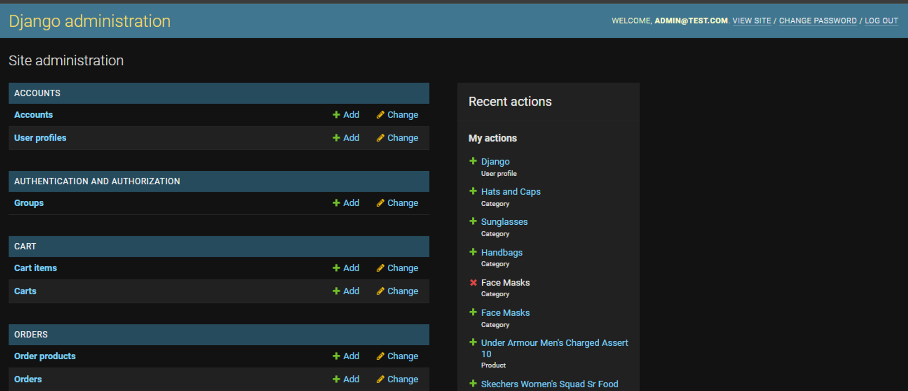
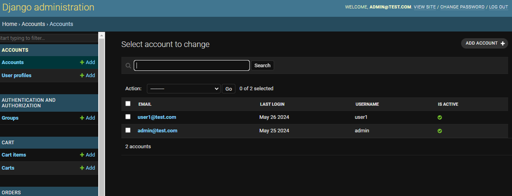
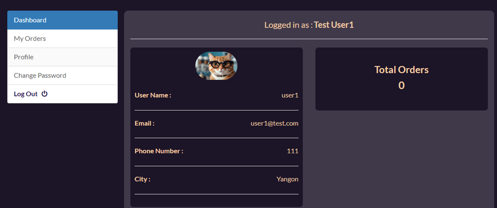
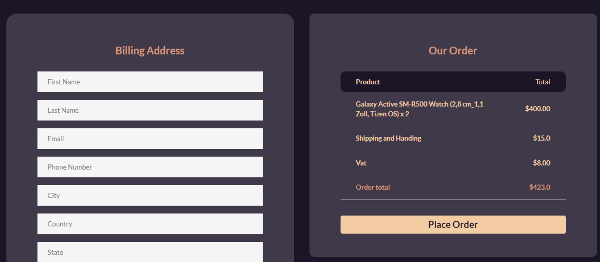
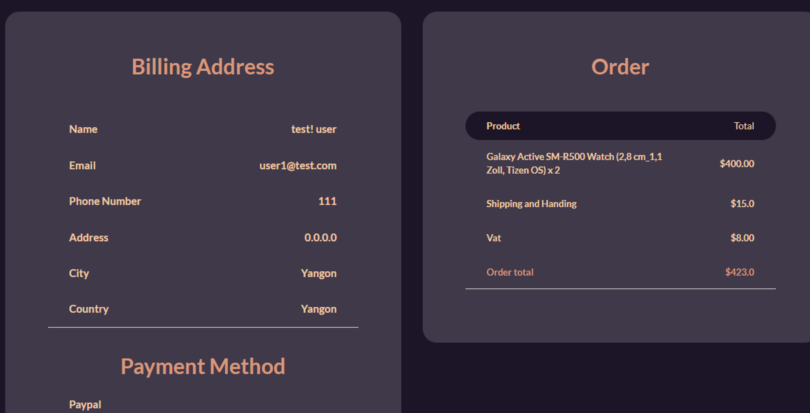

# django-ecommerce-store

I have referenced and modified a Django sample e-commerce application. This application serves as an online store where users can browse and place orders. Admin users have the ability to update and create new products. Additionally, admin user can manage user accounts and utilize various other functionalities provided by the application.

- Application source code repository:
    
    [https://github.com/wwwaiyan/django-ecommerce-store](https://github.com/wwwaiyan/django-ecommerce-store)
    

Below are the URLs for accessing the application: (cloud front urls)

- **Applications url:** [[https://d3aofmnoeu21ra.cloudfront.net/shop/](https://d3aofmnoeu21ra.cloudfront.net/shop/)]
- **Normal user login: [**[https://d3aofmnoeu21ra.cloudfront.net/account/login/](https://d3aofmnoeu21ra.cloudfront.net/account/login/)**]**
- **Admin panel url:** [[https://d3aofmnoeu21ra.cloudfront.net/admin/](https://d3aofmnoeu21ra.cloudfront.net/admin/)]
- **Admin User Credentials:**
    - Username/email: `admin@test.com`
    - Password: `admin`
- **Normal User Credentials:**
    - Username/email: `user1@test.com`
    - Password: `test@123`
- The admin user account and a normal user account have been created. Users can register new accounts, but please note that the email service for account registration is not fully functional. New users need to be manually activated by an admin.

> **Note:** After creating a new user account, the admin must set the user to an active state.
> 
- original source code:
    
    [https://github.com/omarreda22/Django-eCommerce-Store](https://github.com/omarreda22/Django-eCommerce-Store)
    

Here are some screenshots of the application:

django admin dashboard

Normal user

